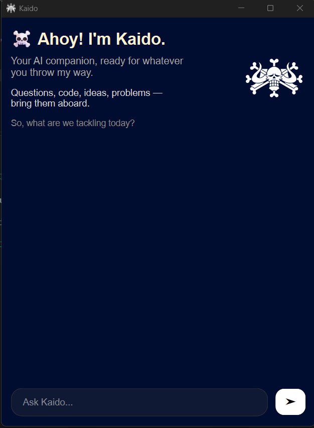

# ☠️ Kaido

> **A Python desktop AI assistant powered by Google Gemini.**

Kaido is a Python desktop AI assistant built with **PySide6** and Google's **Gemini API**. It provides a simple desktop interface for interacting with Gemini.

---

## ✨ Features

* 🤖 AI assistant powered by Gemini
* 🖥️ Desktop interface built with PySide6
* 🔑 Secure environment-variable based API key configuration
* 📝 Markdown support
* 🐍 Python-based application
* ⚡ Lightweight and easy to set up

---

## 📸 Screenshots

<table>
  <tr>
    <td align="center"><b>🏴‍☠️ Welcome Screen</b></td>
    <td align="center"><b>💬 Conversation</b></td>
  </tr>
  <tr>
    <td align="center">
      
    </td>
    <td align="center">
      
    </td>
  </tr>
  
</table>


---

## 🛠️ Requirements

Before installing Kaido, make sure you have:

* 🐍 Python 3.x
* 🔑 Your own Gemini API key
* 🌐 Git

> **Important:** You need to provide **your own Gemini API key** to use Kaido.

---

## 🚀 Installation

### 1️⃣ Clone the repository

```bash
git clone https://github.com/Kunnal23/Kaido-AI
cd Kaido
```

---

### 2️⃣ Create a virtual environment

Creating a virtual environment keeps Kaido's Python packages isolated from the rest of your system.

#### 🪟 Windows

```bash
python -m venv .venv
```

Activate it:

```bash
.venv\Scripts\activate
```

#### 🐧 Linux / 🍎 macOS

```bash
python3 -m venv .venv
```

Activate it:

```bash
source .venv/bin/activate
```

---

### 3️⃣ Install requirements

With the virtual environment activated:

```bash
pip install -r requirements.txt
```

This installs the Python packages required by Kaido.

---

## 🔐 Gemini API Key Setup

Kaido requires a **Gemini API key**.

### ⚠️ Use your own API key

Each user must provide their **own Gemini API key**.

Never share your private API key with anyone and never commit it to GitHub.

### 1️⃣ Create your `.env` file

Copy `.env.example` to `.env`.

#### 🪟 Windows

```bash
copy .env.example .env
```

#### 🐧 Linux / 🍎 macOS

```bash
cp .env.example .env
```

### 2️⃣ Add your API key

Open `.env` and replace:

```text
GEMINI_API_KEY=your_gemini_api_key_here
```

with **your own Gemini API key**.

🚨 **Never upload `.env` to GitHub.**

---

## ▶️ Run Kaido

Once your virtual environment is activated and your `.env` file is configured:

```bash
python app.py
```

🎉 Kaido should now start.

---

## 📁 Project Structure

```text
Kaido/
│
├── 🤖 app.py
├── 🖼️ kaido.png
├── 🔐 .env                 # Local only — never upload
├── 📋 .env.example
├── 🚫 .gitignore
├── 📦 requirements.txt
└── 📖 README.md
```

> 🔒 The real `.env` file is intentionally excluded from the GitHub repository because it contains your private Gemini API key.

---

## 🛡️ Security

### 🔑 Protect your API key

**Never commit your real `.env` file to GitHub.**

The repository contains `.env.example` only as a safe configuration template.

Each user should:

1. 📥 Clone the repository
2. 📄 Create their own `.env`
3. 🔑 Add their own Gemini API key
4. 🚫 Keep `.env` out of Git

If you accidentally publish an API key, **revoke or rotate the exposed key immediately**.

---

## 🤝 Contributing

Contributions are welcome! 🎉

To contribute:

1. 🍴 Fork the repository
2. 🌿 Create a new branch
3. ✏️ Make your changes
4. 🧪 Test your changes
5. 💾 Commit your changes
6. 🚀 Open a pull request

Please do not commit:

* 🔐 API keys
* `.env` files
* 🗂️ Local environment files
* 🐍 Python cache files
* 📦 Unnecessary generated files

---

## 🗺️ Future Plans / Roadmap

Some potential future improvements:

* ✨ Additional assistant capabilities
* 🎨 Further UI improvements
* ⚙️ Additional configuration options
* 📚 Expanded documentation
* 🚀 Other improvements based on project needs

> This roadmap is intentionally flexible and may change as Kaido develops.

---

## 📜 License

**License: TBD**

A specific open-source license will be added in the future.

---

## ⭐ Support

If you find Kaido interesting, consider giving the repository a ⭐ on GitHub!

**Built with 🐍 Python + 🖥️ PySide6 + 💫 Gemini**
